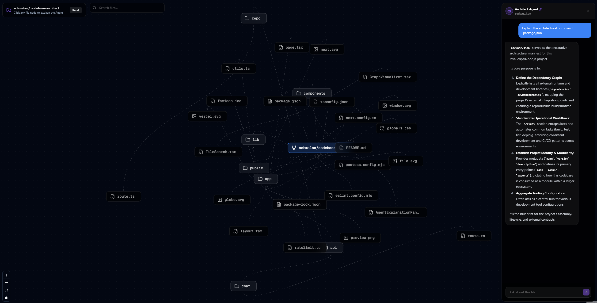

<div align="center">
  
  <h1>Codebase Architect 🏗️✨</h1>
  <p><strong>Transform flat GitHub repositories into beautiful, interactive, AI-explained architectures.</strong></p>
  <p><a href="https://codebase-architect.vercel.app/" target="_blank"><strong>🌐 View Live Demo</strong></a></p>
  <br />
  
</div>

---

## 🌟 What is this?

Codebase Architect is an experimental, visually-stunning tool designed to help developers instantly understand unfamiliar repositories. 

Instead of reading through endless folders of code, simply paste a public or private GitHub URL (using a secure Personal Access Token). The application will fetch the entire codebase structure and render it as an interactive, draggable node-graph.

**The Magic:** Click on any node (file) in the graph, and our embedded **Architect Agent** (powered by Google's cutting-edge Gemini 2.5 Flash model) will instantly stream a concise, "techy" explanation of exactly what architectural purpose that file serves within the broader project context.

## ✨ Features

- 🕸️ **Live Graph Rendering:** Automatically converts deep file-tree hierarchies into beautiful React Flow node graphs.
- 📐 **Multiple Layout Engines:** Toggle seamlessly between Radial (Fibonacci Spiral), Tree (`dagre`), and Cluster (`d3-hierarchy`) topological layouts.
- 🔒 **Private Repository Support:** Bring your closed-source architectures to life using a secure, strictly-proxied GitHub PAT.
- 🤖 **AI Codebase Architect:** Built-in AI assistant using the Vercel AI SDK to explain complex files on demand.
- ⚡ **Lightning Fast Streams:** Real-time text streaming powered by Gemini 2.5 Flash.
- 🛡️ **Production Ready Rate Limits:** Hardened against abuse using Upstash Redis sliding-window IP limits.
- 💅 **Premium Aesthetics:** Dark-mode native, glassmorphism UI built with Tailwind CSS and Framer Motion micro-animations.

## 🛠️ Tech Stack

This project was built to showcase the bleeding edge of modern web and agentic technologies:

- **Framework:** Next.js (App Router) + React 19
- **Agentic AI:** Vercel AI SDK 3.0 + Google Gemini 2.5
- **Visualization:** React Flow (`@xyflow/react`)
- **Styling:** Tailwind CSS + Framer Motion + Lucide Icons
- **Infrastructure:** Vercel Edge + Upstash Redis (Ratelimits)

## 🚀 Getting Started

Want to run your own instance of the Architect? It takes 60 seconds to set up.

### Prerequisites
1. Node.js (v18+)
2. A free Google Gemini API Key (get one at [Google AI Studio](https://aistudio.google.com/))
3. *(Optional)* A free Upstash Redis database for Rate Limiting.

### Installation

1. Clone the repository and install dependencies:
   ```bash
   npm install
   ```
2. Copy the environment template and add your API Keys:
   ```bash
   cp .env.example .env
   ```
3. Open `.env` and configure your `GOOGLE_GENERATIVE_AI_API_KEY`.
4. Start the development server:
   ```bash
   npm run dev
   ```
5. Navigate to `http://localhost:3000` and start exploring repositories!

## 💡 How it Works Under the Hood

1. **The Graph Engine:** The `/api/repo` route securely proxies GitHub API requests (with optional PAT auth) to fetch the raw recursive Tree. It strips out noise (like `.git` and `node_modules`), caps the payload to avoid browser crashes, and serves it to the frontend.
2. **The Layout Algorithms:** We use a combination of custom math (`radial`), `dagre` (`tree`), and `d3-hierarchy` (`cluster`) to dynamically calculate topological node coordinates based on directory groupings and depth.
3. **The AI Stream:** When a node is clicked, an isolated `/api/chat` request runs. It gives the AI the name of the file *and* the names of the other 500 files surrounding it (as context). The Vercel AI SDK then streams the explanation chunk-by-chunk back to the React UI, applying a `framer-motion` thinking state while connecting.

---

<div align="center">
  <p>Built with ❤️ by Alex</p>
</div>
